## Crear Pipeline

Para crear una pipeline nueva, vamos a “Nueva tarea” en el menú principal y seleccionamos “Pipeline” e introducimos el nombre.

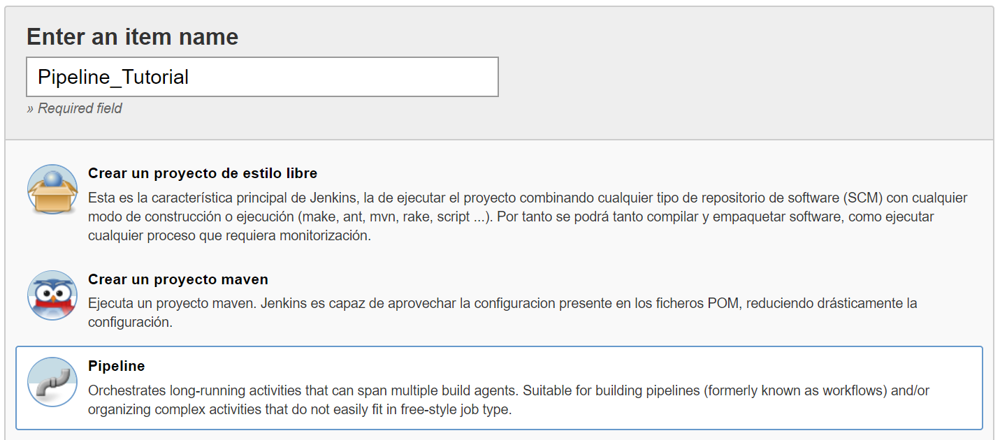

Luego pasaremos a la propia pantalla de configuración donde podemos activar varias opciones.

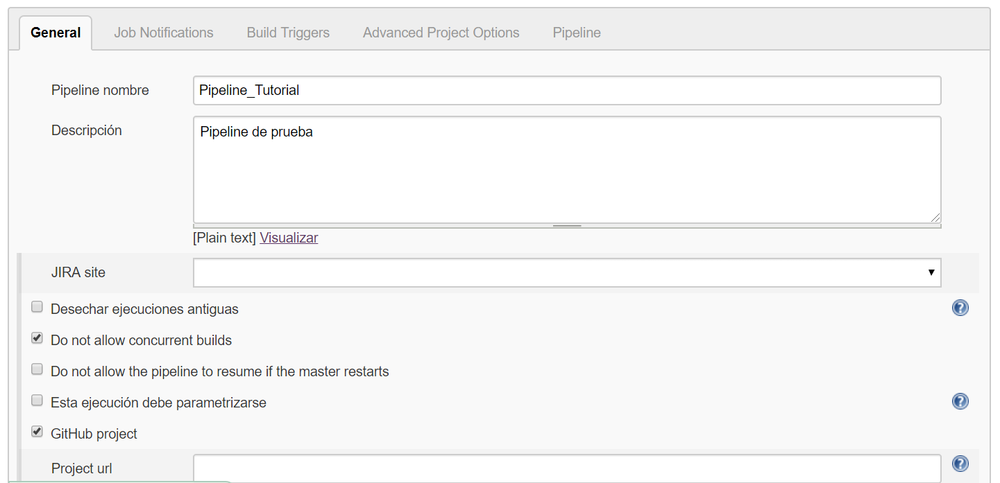

Lo más importante es la propia pipeline. Se puede usar un script dentro de Jenkins, o vincular la pipeline a un Jenkinsfile (El archivo con la pipeline) remoto en un repositorio de Git.

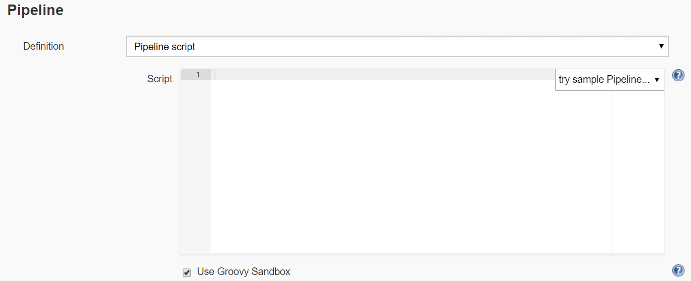
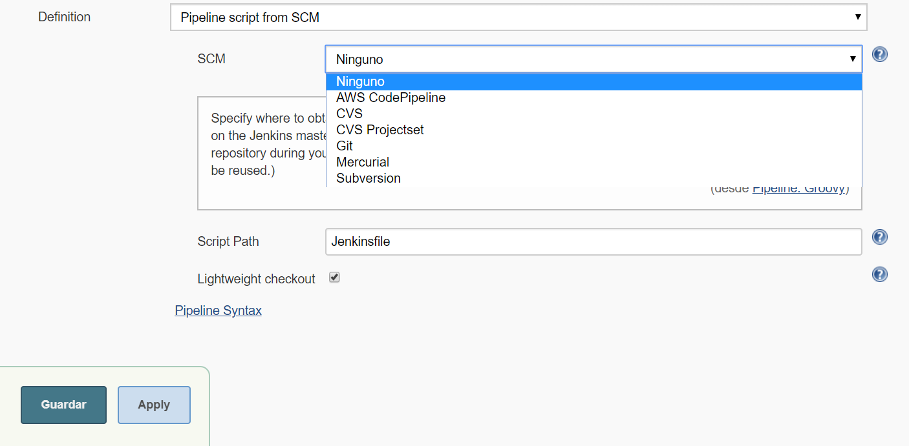

## Configurar credenciales

Para configurar credenciales de acceso necesitamos insertarlas en Jenkins para evitar exponerlas en un repositorio remoto que podría no ser seguro.

En particular, para insertar las credenciales de AWS, primero es necesario instalar el plugin de “CloudBees AWS Credentials Plugin”.

Posteriormente vamos a “Pipeline Syntax > Snippet Generator” y seleccionamos “With credentials: Bind credentials to variables”. Y en “Bindings” añadimos “AWS Access key and secret”.

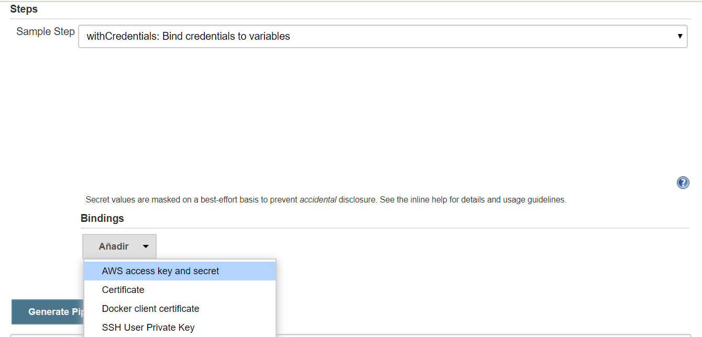

Posteriormente seleccionamos el símbolo de “Add” para añadir credenciales nuevas.

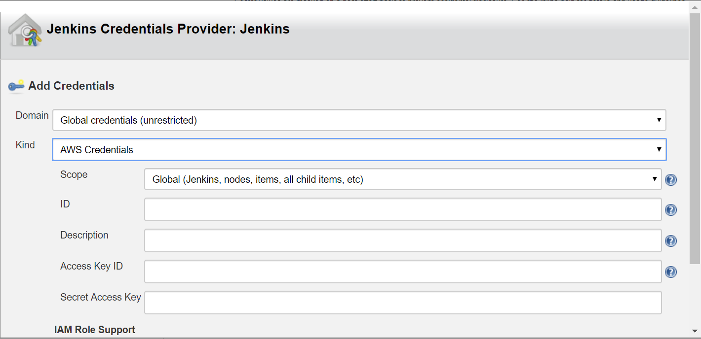

Tras añadir las credenciales, seleccionamos las credenciales y le damos a “Generate Pipeline Script” y se creará un bloque de texto.

Dentro de este bloque, se podrán usar las variables de `AWS_ACCESS_KEY_ID` y `AWS_SECRET_ACCESS_KEY` para que el propio Jenkins las sustituya por los valores almacenados internamente con el valor `credentialsId`.

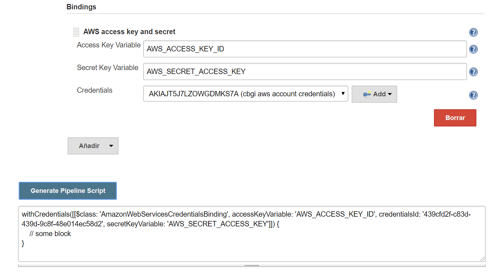

El siguiente paso para configurar una pipeline de Jenkins es instalar las herramientas necesarias en el sistema. En este caso, Terraform, Packer y Node.

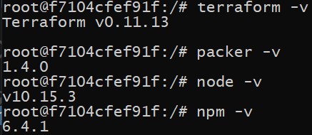

Después es necesario instalar los plugins correspondientes y configurar el path de instalación en Jenkins en “Configurar Jenkins > Global Tool Configuration”.

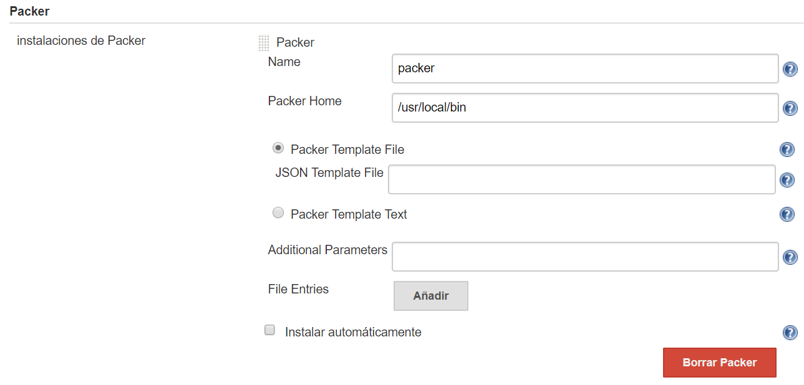
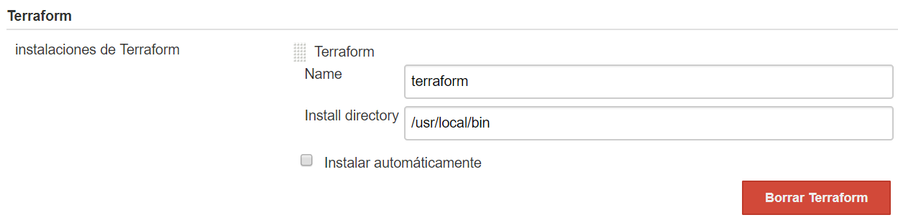

También podemos seleccionar la instalación que queremos usar con el Snippet Generator:

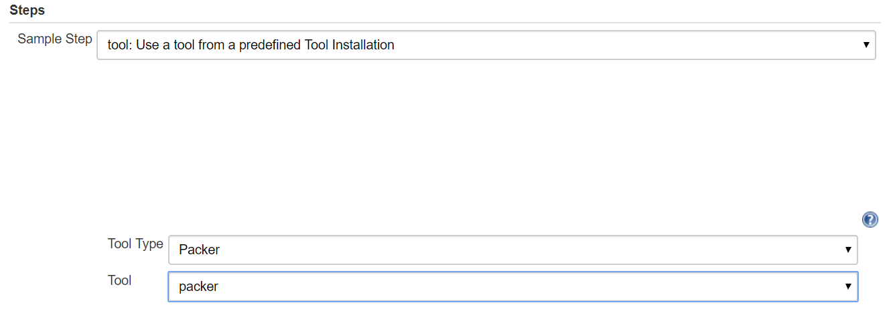

Y, en vez de instalar las herramientas, podemos pedir a Jenkins que las instale por nosotros al usarlas:

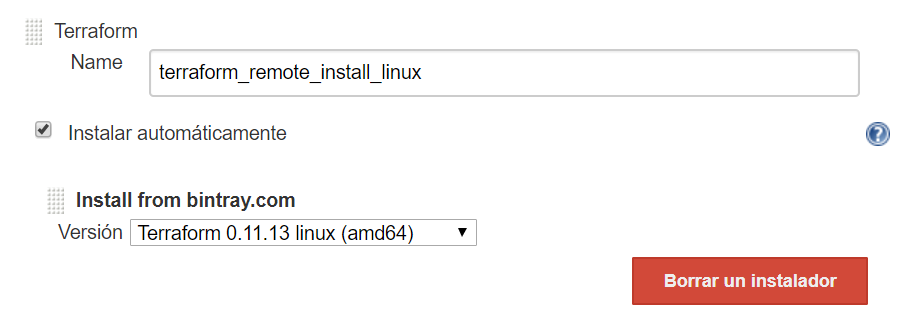

## Jenkinsfile

```
pipeline{
    agent{
        label "node"
    }
    stages{
        stage("A"){
            steps{
                echo "========executing A========"
            }
            post{
                always{
                    echo "========always========"
                }
                success{
                    echo "========A executed successfully========"
                }
                failure{
                    echo "========A execution failed========"
                }
            }
        }
    }
    post{
        always{
            echo "========always========"
        }
        success{
            echo "========pipeline executed successfully ========"
        }
        failure{
            echo "========pipeline execution failed========"
        }
    }
}
```